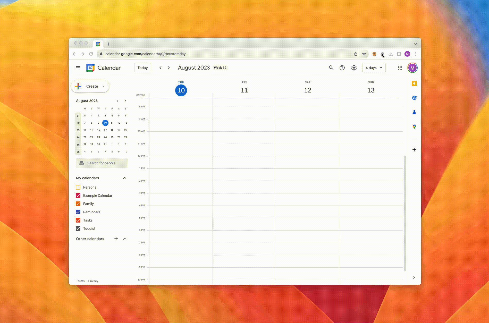
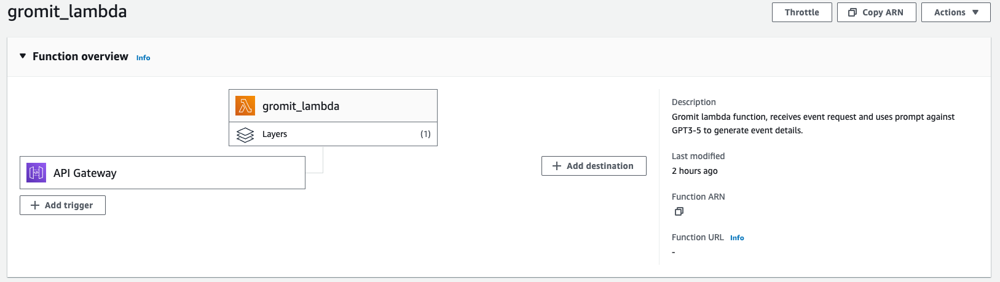

# Gromit AI: Smart Calendar Events

Create calendar events with ease with Gromit.
Gromit provides natural language Google calendar event creation, powered by GPT-3.5. Currently packaged as a simple-to-use Chrome extension, with multi-calendar event targeting support.

## Setup

- Serverless Lambda function that connects to OpenAI API, hosts the prompts, and packages the OpenAI response (separate serverless func allows for continuous scaling and individual event processing)
- Vanilla JS frontend (Chrome extension) that calls the Lambda through API gateway
- OAuth 2.0 for the frontend client to request permissions from Google Calendar and have access granted to read/write events, and read a list of available calendars

## Install

- Through the Chrome web store (coming soon!)
- Load unpacked (through developer options) in Chrome extensions manager (loadable release ZIPs will be available in `release/`)

## WIP

- Right click any text within a browser session to parse the text and create a calendar event
- Support for further fields such as event color, status, etc. (currently supports summary, description, start, end, and location, including all day events)

## License

MIT
